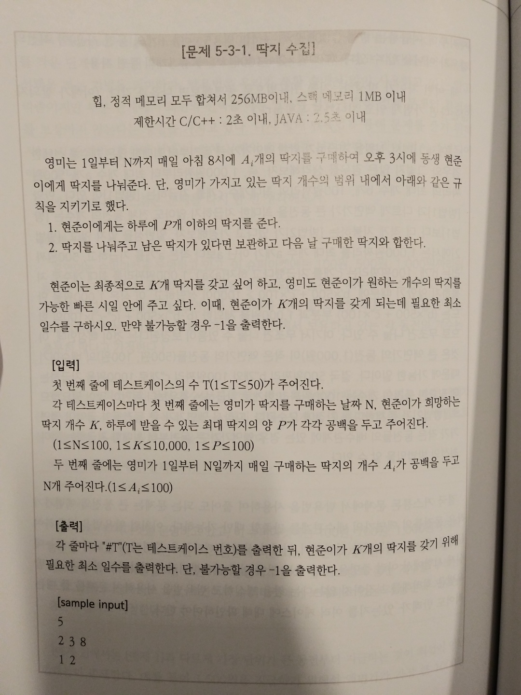
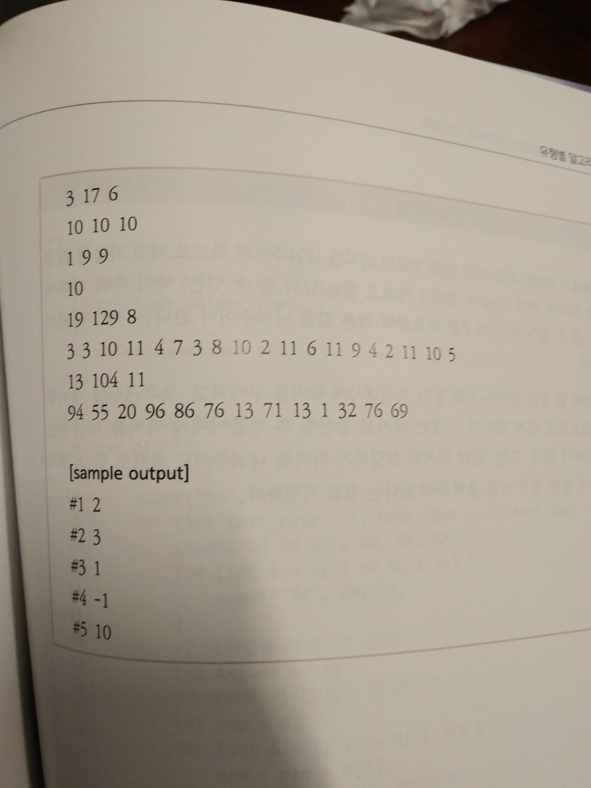

## 1. MessageSplit from codility

[https://app.codility.com/tickets/FJ8VHF-SW7/share/3e6d831b7bdd70122797012444b9c80f3634a89d9253dacbb64fd2272f230b9b/](https://app.codility.com/tickets/FJ8VHF-SW7/share/3e6d831b7bdd70122797012444b9c80f3634a89d9253dacbb64fd2272f230b9b/)

    public class HelloWorld
    {
      public static void main(String[] args)
      {
        Solution solution = new Solution();

        String[] S_array = {
          "SMS messages are really short",
          "arguments are passed using the text field below this editor",
          "a a a a a",
          "1234567",
          "1234567",
          "1 2 3 4 5",
          "1 2 3 4 5",
        };
        int[] K_array = {
          12,
          13,
          10,
          7,
          6,
          9,
          8
        };

        for(int i=0;i<S_array.length;i++)
        {
          int answer = solution.solution(S_array[i], K_array[i]);
          System.out.println(answer);
        }
      }
    }

    public class Solution
    {
      public int solution(String S, int K)
      {
        String[] chunks = S.split(" ");
        // ["SMS", "messages", "are", "really", "short"]

        int[] chunk_lens = new int[chunks.length];
        for(int i=0;i<chunks.length;i++)
        {
          // if chunk length is more than K, it means that can't send it
          chunk_lens[i] = chunks[i].length();
          if(chunk_lens[i] > K)
          {
            return -1;
          }
        }

        // find answer
        int answer = 0;
        int i = 0;
        while(true)
        {
          answer++;
          i = find_maximum_chunk_length(chunk_lens, i, K);
          if(i == -1)
          {
            break;
          }
        }
        return answer;
      }

      public int find_maximum_chunk_length(int[] chunk_lens, int cursor, int K)
      {
        // [3, 8, 3, 6, 5]

        int concatenated_len = -1;
        for(int i=cursor;i<chunk_lens.length;i++)
        {
          concatenated_len += chunk_lens[i] + 1;
          if(concatenated_len > K)
          {
            return i;
          }
        }
        return -1;
      }
    }

## 2. 딱지수집

    public class HelloWorld
    {
      public static void main(String[] args)
      {
        Solution solution = new Solution();

        String[] input_array = {
          "2 3 8,1 2",
          "3 17 6,10 10 10",
          "1 9 9,10",
          "19 129 8,3 3 10 11 4 7 3 8 10 2 11 6 11 9 4 2 11 10 5",
          "13 104 11,94 55 20 96 86 76 13 71 13 1 32 76 69",
        };

        for(int i=0;i<input_array.length;i++)
        {
          String[] input = input_array[i].split(",");
          String[] NPK = input[0].split(" ");
          String[] A_strings = input[1].split(" ");
          int answer = solution.solution(Integer.parseInt(NPK[0]), Integer.parseInt(NPK[1]), Integer.parseInt(NPK[2]), A_strings);
          System.out.println(answer);
        }
      }
    }

    public class Solution
    {
      public int solution(int N, int K, int P, String[] A_strings)
      {
        int youngmi_ttakji = 0;
        int hyunjun_ttakji = 0;
        for(int i=0;i<N;i++)
        {
          // youngmi buy ttakji
          youngmi_ttakji += Integer.parseInt(A_strings[i]);

          // youngmi give ttakji huynjun
          int give_ttakji;
          if (youngmi_ttakji >= P){
            give_ttakji = P;
          }
          else{
            give_ttakji = youngmi_ttakji;
          }
          youngmi_ttakji -= give_ttakji;
          hyunjun_ttakji += give_ttakji;

          // check hyunjun_ttakji
          if (hyunjun_ttakji >= K)
          {
            return i+1;
          }
        }
        return -1;
      }
    }